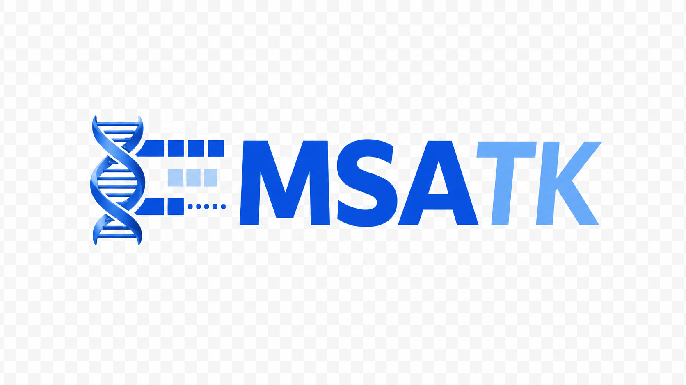

# MSATK

<p align="center">
  
</p>


**MSATK** is a Python and command-line toolkit for profiling multiple sequence alignments. It converts nucleotide, protein, and codon-aware alignments into quality-control summaries, per-sequence and per-site statistics, publication-ready plots, codon usage metrics, RSCU tables, and standalone HTML reports.

> **MSATK: one command to profile, visualize, and report multiple sequence alignments.**

## Quick Start

```bash
mamba install -c bioconda -c conda-forge msatk
msatk profile alignment.fasta
```

MSATK automatically detects the input format and molecule type, computes summary statistics, generates plots when plotting dependencies are available, and writes a complete report.

```text
alignment_msatk/
|-- report.html
|-- summary.json
|-- parameters.yaml
|-- msatk.log
|-- qc_warnings.txt
|-- tables/
`-- figures/
```

Try the bundled demo:

```bash
msatk demo
```

## Installation

### With Conda

The recommended bioinformatics-native install path is Bioconda:

```bash
mamba install -c bioconda -c conda-forge msatk
```

or:

```bash
conda install -c bioconda -c conda-forge msatk
```

Before the official Bioconda package is available, create an environment with Conda-managed dependencies and install MSATK from PyPI:

```bash
conda env create -f environment.yml
conda activate msatk
```

After Bioconda packaging is live, use:

```bash
conda env create -f environment-bioconda.yml
conda activate msatk
```

### With pip

```bash
pip install msatk
```

### Development install

```bash
git clone https://github.com/yourname/msatk
cd msatk
pip install -e ".[dev,all,docs]"
```

## How To Run Locally

From the repository root:

```bash
pip install -e ".[dev,all,docs]"
```

Run the bundled demo:

```bash
msatk demo --out msatk_demo --force
```

Profile your own alignment:

```bash
msatk profile path/to/alignment.fasta
```

Write to a specific output directory:

```bash
msatk profile path/to/alignment.fasta --out results --force
```

Run codon-aware or protein-specific modes:

```bash
msatk codon path/to/cds_alignment.fasta --out codon_results --force
msatk protein path/to/protein_alignment.faa --out protein_results --force
```

Run tests and checks:

```bash
pytest
ruff check src/msatk tests
ruff format --check src/msatk tests
mkdocs build --strict
```

If you are running without installing the package, set `PYTHONPATH` first:

```bash
# macOS/Linux
PYTHONPATH=src python -m msatk.cli demo --out msatk_demo --force

# Windows PowerShell
$env:PYTHONPATH="src"; python -m msatk.cli demo --out msatk_demo --force
```

## Why MSATK?

- One-command alignment profiling
- DNA, RNA, protein, and codon-aware modes
- Common alignment inputs: FASTA/aligned FASTA, A3M, PHYLIP/relaxed PHYLIP, CLUSTAL, Stockholm, NEXUS, MAF, SAM, BAM, and CRAM
- Publication-ready PNG plots with optional plotting dependencies
- CSV, JSON, HTML, and Markdown outputs
- Codon usage, RSCU, GC1/GC2/GC3, and stop codon summaries
- Protein amino-acid, residue-class, and hydrophobicity summaries
- QC warnings with plain-language interpretation
- Python API for notebooks and workflows
- Stable output files for Snakemake, Nextflow, and HPC pipelines

## Supported Input Types

Core formats:

- FASTA
- aligned FASTA
- PHYLIP
- relaxed PHYLIP
- NEXUS
- CLUSTAL
- Stockholm
- A3M
- MAF
- SAM
- BAM/CRAM-derived alignment summaries

Sequence types:

- nucleotide alignments
- amino-acid alignments
- codon alignments
- translated CDS alignments
- mixed or auto-detected mode

MSATK automatically infers:

- file format
- molecule type: DNA, RNA, protein, codon, translated CDS, or mixed
- alignment length
- whether sequence lengths are consistent
- whether stop codons exist
- whether frameshift warnings are present
- whether the alignment appears codon-aware

These fields are written to `summary.json`, `tables/alignment_summary.csv`, and the HTML report.

## Install Extras

```bash
pip install "msatk[all]"
```

Useful extras:

```bash
pip install "msatk[dataframes]"
pip install "msatk[plots]"
pip install "msatk[embed]"
pip install "msatk[ngs]"
```

`SAM` is supported without extra dependencies. `BAM` and `CRAM` require `pysam`; install with `pip install "msatk[ngs]"` or `mamba install -c conda-forge pysam`.

Developer install:

```bash
pip install -e ".[dev,all]"
```

## Conda And Bioconda Packaging

MSATK is intended to be distributed through PyPI first, then Bioconda:

```text
PyPI first -> local Conda recipe -> Bioconda PR -> CI-tested Conda builds
```

The local Conda recipe is in:

```text
conda-recipe/meta.yaml
```

Build and test it locally:

```bash
mamba create -n conda-build-env -c conda-forge conda-build boa anaconda-client
conda activate conda-build-env
conda build conda-recipe

mamba create -n test-msatk --use-local msatk
conda activate test-msatk
msatk --help
msatk profile --help
```

For Bioconda submission after a PyPI release, use:

```text
conda-recipe/meta.bioconda.yaml
```

Update the PyPI source SHA256, copy it to `recipes/msatk/meta.yaml` in a fork of `bioconda/bioconda-recipes`, and open a pull request.

## CLI

```bash
msatk profile alignment.fasta
msatk qc alignment.fasta
msatk codon cds_alignment.fasta
msatk protein protein_alignment.faa
msatk embed alignment.fasta --method pca
msatk report alignment_msatk/
msatk demo
```

Example terminal output:

```text
MSATK alignment profile complete

Input: alignment.fasta
Detected type: codon
Sequences: 248
Alignment length: 3,642
Gap fraction: 4.8%
Variable sites: 712
Mean pairwise identity: 91.4%

Results written to:
alignment_msatk/
Open report:
alignment_msatk/report.html
```

## Python API

```python
from msatk import MSATK, CodonProfiler, ProteinProfiler, profile_alignment

profiler = MSATK("alignment.fasta")
summary = profiler.summary()
per_sequence = profiler.per_sequence_stats()
per_site = profiler.per_site_stats()

profiler.plot_gap_profile()
profiler.plot_entropy()
profiler.write_report("report.html")

results = profile_alignment("alignment.fasta", outdir="alignment_msatk")

codon = CodonProfiler("cds_alignment.fasta")
rscu = codon.rscu()

protein = ProteinProfiler("protein_alignment.faa")
aa = protein.amino_acid_composition()
```

Lowercase alias is also supported:

```python
from msatk import msatk

profiler = msatk("alignment.fasta")
```

When pandas is installed, table-like API methods return pandas DataFrames. In minimal environments, MSATK falls back to lists of dictionaries.

## Roadmap

- `0.1`: one-command profiling, summary statistics, QC, tables, report
- `0.2`: hardened format support, better terminal output, example datasets
- `0.3`: codon-aware release with RSCU, GC1/GC2/GC3, stop codon detection
- `0.4`: visualization themes, SVG output, richer report customization
- `0.5`: embeddings, clustering, outlier detection
- `1.0`: stable API/output schema, PyPI/Bioconda, containers, workflow examples
