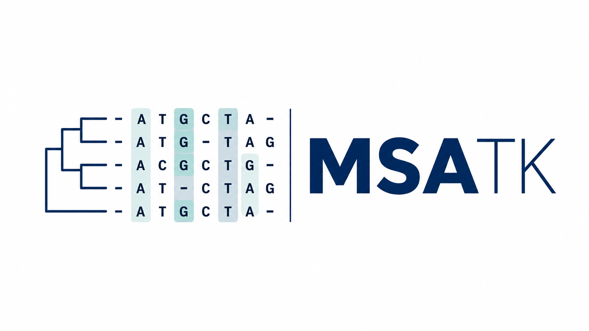

# MSATK



MSATK is a Python and command-line toolkit for profiling multiple sequence alignments. It turns nucleotide, protein, and codon-aware alignments into QC summaries, per-sequence and per-site statistics, plots, codon/protein summaries, and shareable reports.

```bash
pip install msatk
msatk profile alignment.fasta
```

The default output is a FastQC-like directory with `report.html`, `summary.json`, `qc_warnings.txt`, `tables/`, and `figures/`.
